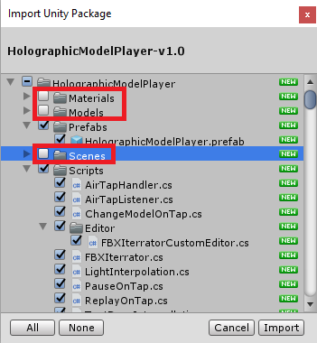
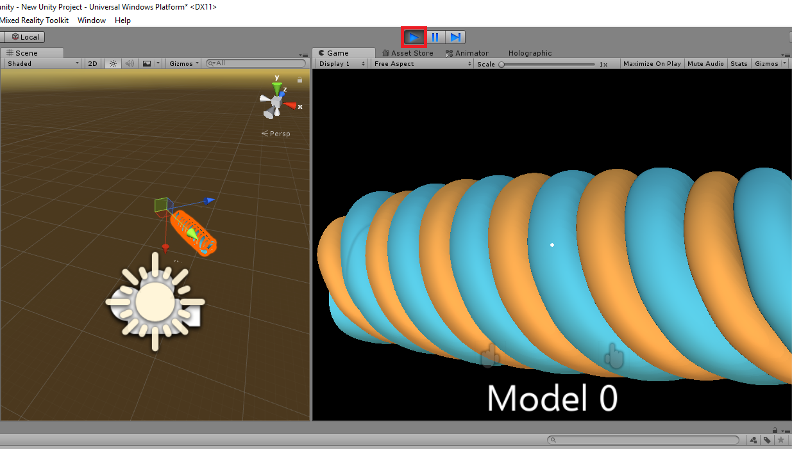

# Holographic Model Player

A Unity asset package for playing and interacting with holographic animations and models composed of surface contours.

## Using a Holographic Model Player in your project

Refer to [https://gitlab.tacc.utexas.edu/edivera/Su18-PEARC-HololensPlasma](https://gitlab.tacc.utexas.edu/edivera/Su18-PEARC-HololensPlasma) 
for instructions on getting started with Holographic Remoting.

### Importing the player, and playing a model

1. Pick and download a released package below.
2. Inside your unity project, go to Assets, Import Package, Custom Package...                                                                                                

3. Go to the package directory, and Open the package.

4. Unity will start decompressing the package. When the list of assets in the package shows up, simply click on Import (left picture). For faster importing, 
leave out the example that comes out with the package by deselecting Materials, Models, and Scenes under HolographicModelPlayer (right picture).                                                                                                         
 
5. Once it's finished importing, delete the default Main Camera and Directional Light.                                                                                   

6. Go under HolographicModelPlayer in the explorer window, under Prefabs, to find the HolographicModelPlayer.prefab object. It should look like a blue cube.                                                                                                        

7. Drag the prefab onto your hierarchy window.                                                                                                                         

8. Collapse the hierarchy to find the ModelCollection object. **IMPORTANT**: also find the DELETE_ME object and delete it to ensure that FbxIterrator script 
saves models correctly.

9. Make a new object under it, and give it a name of your choice.                                                                                                      

10. Add your fbx (or any other unity supported 3d format) contours into Unity. One way to do this is by dragging them from windows explorer into the explorer window 
in Unity. Note, you may need to export the materials from your contours to change their color (the example model has already had its materials extracted). To do this, 
select all of your contours from the explorer window (first picture), and then, in the inspector window, click on Materials, Extract Materials... (second picture)

11. Drag your contour objects under the object you just made under the ModelCollection.

12. Do 9 and 11 for as many different contour groups as your model has. This example has two (1 and -1).                                                                 

13. CLick on ModelCollection, and use the move and rotate tools to position your model within the view of the camera. Additionally, you could use the transform
 component in the inspector window. Look at the Game window side by side to help you position it.

14. Once you've position it, press play, and it will start animating it with the name Model 0. You will see it in the Game window, but you can also connect your
 Hololens to see it via holographic emulation at this point.

### Customizing your player

1. Click on ModelCollection to show its customization menu in the inspector window.

2. Notice the warning in the inspector window. This what happens when you press play without first setting up your models to be played. It's a quick way to play your contours.                                                                        

3. Let's start by setting up the first model. Click Add Model. The menu should change into the picture on the right.                                                          
 
4. You can change the title of the model by using the title field, and if you need a short description, the subtitle field will be a smaller text. You can also leave them
 empty. The title and subtitle text you see from the game window will be changed to these fields after pressing play.

5. Next, use the Total field under contours to set the number of contours for your model. It is 2 by default. Drag and drop your contours from your hierarchy window into the
 object fields below total; without moving these, the scene will not show anything.

6. You can have multiple models in one scene. Click Add Model again to add another. Note: I recommend not having too many models per scene, and maybe having a model per scene.
7. You can only view one model at the time. You can pick which model to start the scene on by changing the Current Model Index, where 0 is the first model.                                                              

8. You can also change how all the models will be played by changing the Play Mode. PLAY CURRENT will play the current model once. REPLAY ALL will play though all the models
 and loop. REPLAY CURRENT will loop through the current model.                                                                

9. To change the starting speed of every animation. Change Animation Fps (Frames per second). It is 20 by default                                                              

10. Notice the selected toggle button. This is a radio button for all of the models; only one model can be selected at the time. If you want to change the play order of
 your models, you can move the selected model up and down using these buttons.                                                               
 
11. Similarly, you can delete the selected model using the Delete Selected Model button.                                                             
 

### Air Tap Handlers and Listeners

You can decide what happens with an air tap with simple drag and drops.

1. Collapse Handlers and Listeners objects in the hierarchy window, and click on the AirTapListener.                                                                  

2. Notice the On Air Tap object in the inspector window for AirTapListener. Setting this object decides what happens when you air tap with the hololens. By default, it will
 change the model (ChangeModelOnTap), which will go onto the next model in your ModelCollection and loop to the beginning if it is at the last model.                                                                   

3. The available handlers are under the Handlers. In addition to ChangeModelHandler, there is PauseOnTap and ReplayOnTap. PauseOnTap will pause the model at its current
 frame. ReplayOnTap will replay the current model playing from its first frame. Further development will focus on adding handlers with extended funcitonality. Note: you
 can also create your own handler scripts as long as you extend AirTapHandler.                                                                                          

4. To change the handler, simply drag you choice from the hierarchy into the On Air Tap field, and that's it!

5. Press play and your new handler should work when tapping in the hololens.

## Usage example

Inside the package, there is an example scene under HolographicModelPlayer, Scenes, Example. Double click it to open it. Don't forget to save any other scene you have open!                                                                        

## Releases

All releases can be found under the Releases folder

* [v1.0](https://gitlab.tacc.utexas.edu/edivera/HolographicModelPlayer/blob/master/Releases/HolographicModelPlayer-v1.0.unitypackage)
    * First working release

## Development Setup

Refer to [https://gitlab.tacc.utexas.edu/edivera/Su18-PEARC-HololensPlasma](https://gitlab.tacc.utexas.edu/edivera/Su18-PEARC-HololensPlasma) 
for instructions on getting started with Holographic Remoting.

Download or clone this repository.
> git clone https://gitlab.tacc.utexas.edu/edivera/HolographicModelPlayer.git

> cd HolographicModelPlayer